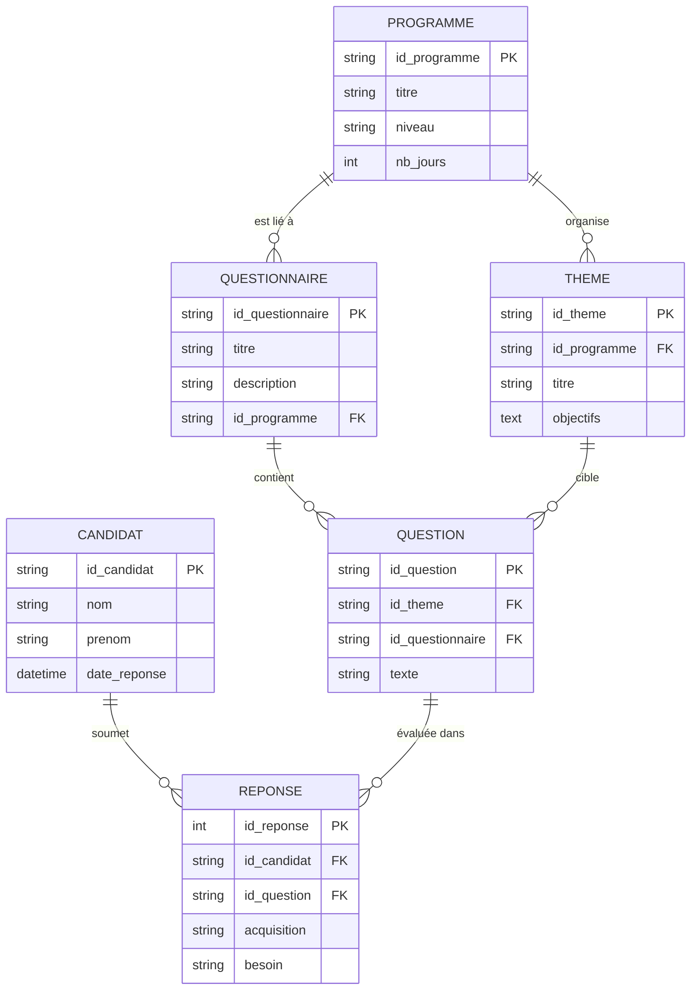

# Cahier des Charges (CDC) & Spécifications Techniques

Ce document consigne les choix techniques, l'architecture, et la logique "d'intelligence" métier de la plateforme **eS@deq Positionnement**.

## 1. Architecture Générale de la Solution

L'application a été pensée pour être ultra-réactive, portable et facile à déployer en local sans infrastructure lourde.

*   **Backend** : Python 3.x avec le framework Flask.
*   **Base de Données / Stockage** : Architecture "Flat-File" (Fichiers plats JSON et CSV). Aucun serveur SQL requis. Cela permet des sauvegardes par simple copier-coller et une exécution ultra-légère.
*   **Frontend** : HTML5, CSS3 (Vanilla) et JavaScript (Vanilla). 
    *   Design system : Approche "Premium" avec typographie moderne (*DM Sans/Inter*), palette soignée (Navy, Cream, Gold) et micro-animations.
    *   Icônes : FontAwesome 6.
*   **Exports** : 
    *   PDF : Génération de documents stylisés via `WeasyPrint` à partir de templates HTML.
    *   Excel : Génération native via `openpyxl`.

## 2. Choix Techniques UI/UX (Performances)

L'expérience utilisateur est pensée pour se rapprocher d'une application monopage (SPA) sans la lourdeur d'un framework frontend type React ou Angular :

*   **Recherche et Filtrage Proactif (AJAX)** : 
    La liste des candidats intègre la recherche instantanée gérée en **Vanilla JS avec fonction de Debounce (300ms)**. L'application interroge le serveur en arrière-plan sans recharger la page et applique un "DOM Diffing" manuel pour remplacer le tableau. **Avantage** : Rendu quasi-instantané, très peu d'appels serveur, maintien du focus utilisateur.
*   **Tableaux de bord (Dashboard)** :
    L'animation des barres de progression graphiques est gérée en pur CSS/JS via la lecture d'attributs HTML (`data-width`). Les données statistiques sont pré-calculées côté serveur lors de l'appel pour optimiser le temps de latence au profit du navigateur.

## 3. Logique d'Intelligence et d'Analyse (Le Cœur du Système)

La vraie plus-value du système réside dans `analyse_besoins.py`. Ce moteur croise le référentiel de compétences (notamment **TOSA**) avec les réponses du candidat pour générer un parcours sur-mesure.

### 3.1. Règle d'Analyse Pivot (Grille Croisée)
L'intelligence du système croise deux critères saisis par le candidat :
1.  **Le niveau d'Acquisition perçu** (Aucun, Moyen, Acquis)
2.  **L'expression du Besoin de formation** (Oui, Non)

**Matrice de Décision Mathématique :**
*   `Acquisition = "Aucun" ou "Non"` ET `Besoin = "Oui"` ➔ **Besoin Fort** (Priorité 1)
*   `Acquisition = "Moyen"` ET `Besoin = "Oui"` ➔ **Besoin Moyen** (Priorité 2)
*   `Acquisition = "Acquis"` ET `Besoin = "Oui"` ➔ **À Revoir / Besoin Faible** (Priorité 3)
*   `Besoin = "Non"` ➔ **Ignorer** (Compétence exclue du programme final)

### 3.2. Extraction Métadonnées (Génération de Niveaux)
*   Le moteur extrait intelligemment les niveaux TOSA depuis le formalisme des identifiants des questions (ex: `[D1-N1-C4]`).
*   La variable `NX` (ici `N1`, `N2`, `N3`) est dynamiquement injectée dans le rendu HTML et PDF sous forme de parenthèses (ex: *Ouvrir un classeur (N1)*) pour certifier la couverture du besoin.

### 3.3. Algorithme de Séquençage (Déroulé Pédagogique)
Le programme généré n'est pas une simple liste. Il est organisé :
1.  **Filtrage** : Les compétences sont éliminées ou intégrées selon la matrice de décision.
2.  **Groupement** : Elles sont classifiées par "thèmes" de formation originaux.
3.  **Calcul du poids** : L'algorithme calcule le nombre d'heures nécessaires par thème en pondérant mathématiquement l'importance du besoin (Fort = plus de temps alloué, Faible = traitement purement révisionnel).
4.  **Déroulé chronologique** : Les séances sont structurées pour respecter la durée de formation de façon ascendante (Initiation ➔ Perfectionnement).

## 4. Sécurité et Intégrité des Données

*   Le processus d'import/export de candidats utilise le principe de l'**idempotence** : Lorsqu'un candidat est supprimé, il n'est pas perdu dans le néant mais passe par une fonction d'archivage générant un "snapshot" horodaté dans le dossier `data/archives/candidats/`.
*   Les données sensibles sont isolées dans la structure JSON. L'absence de SGBD (comme MySQL) élimine naturellement 99% des vecteurs classiques d'attaques de type "SQL Injection" à l'échelle de ce logiciel.

## 5. Perspectives d'Évolution

*   **Scalabilité** : Si les candidats dépassent les dizaines de milliers, un passage vers `SQLite` sera requis pour la pagination et le filtrage.
*   **Connectivité** : Possibilité d'étendre les APIs Python vers une intégration webhook directe avec Moodle/LMS existant afin d'importer les questionnaires de positionnement en un clic.

## 6. Annexe : Modèle Relationnel (MCD) et Script SQL

Dans le cadre d'une hypothétique évolution future vers une base de données SQL (ex: PostgreSQL, MySQL, SQLite), les fichiers JSON actuels se traduiraient directement en entités relationnelles. 

**Cependant**, comme l'exigence forte du projet eS@deq est de fonctionner sur un disque dur USB mobile **sans aucune installation** logicielle (Zéro Setup), **ces schémas ne sont donnés qu'à titre strictement informatif et le projet demeure en architecture "Flat-File" (JSON).**

### 6.1. Modèle Conceptuel de Données (MCD)

Ce schéma représente l'entrelacement des données contenues aujourd'hui dynamiquement dans `data/bd/` (référentiel) et `data/candidats/` (données entrantes).



### 6.2. Script SQL d'Initialisation (Exemple DDL Pédagogique)

Voici à quoi ressemblerait le mapping SQL relationnel pour que ça "aspire" les fichiers JSON actuels si la décision d'installer une stack technique (comme MySQL/Postgres) était prise plus tard :

```sql
-- Structure de base de données à titre purement conceptuel

CREATE TABLE programme (
    id_programme VARCHAR(50) PRIMARY KEY,
    titre VARCHAR(255) NOT NULL,
    niveau VARCHAR(50),
    nb_jours INT
);

CREATE TABLE questionnaire (
    id_questionnaire VARCHAR(50) PRIMARY KEY,
    id_programme VARCHAR(50) NOT NULL,
    titre VARCHAR(255) NOT NULL,
    description TEXT,
    FOREIGN KEY (id_programme) REFERENCES programme(id_programme) ON DELETE CASCADE
);

CREATE TABLE theme (
    id_theme VARCHAR(50) PRIMARY KEY,
    id_programme VARCHAR(50) NOT NULL,
    titre VARCHAR(255) NOT NULL,
    objectifs TEXT,
    FOREIGN KEY (id_programme) REFERENCES programme(id_programme) ON DELETE CASCADE
);

CREATE TABLE question (
    id_question VARCHAR(50) PRIMARY KEY,
    id_questionnaire VARCHAR(50) NOT NULL,
    id_theme VARCHAR(50),
    texte TEXT NOT NULL,
    FOREIGN KEY (id_questionnaire) REFERENCES questionnaire(id_questionnaire) ON DELETE CASCADE,
    FOREIGN KEY (id_theme) REFERENCES theme(id_theme)
);

CREATE TABLE candidat (
    id_candidat VARCHAR(50) PRIMARY KEY,
    nom VARCHAR(100) NOT NULL,
    prenom VARCHAR(100) NOT NULL,
    date_reponse TIMESTAMP DEFAULT CURRENT_TIMESTAMP
);

CREATE TABLE reponse (
    id_reponse SERIAL PRIMARY KEY,    -- Selon SGBD (AUTO_INCREMENT, etc.)
    id_candidat VARCHAR(50) NOT NULL,
    id_question VARCHAR(50) NOT NULL,
    acquisition VARCHAR(50),          -- ex: 'Aucun', 'Moyen', 'Acquis'
    besoin VARCHAR(50),               -- ex: 'Oui', 'Non'
    FOREIGN KEY (id_candidat) REFERENCES candidat(id_candidat) ON DELETE CASCADE,
    FOREIGN KEY (id_question) REFERENCES question(id_question)
);
```
